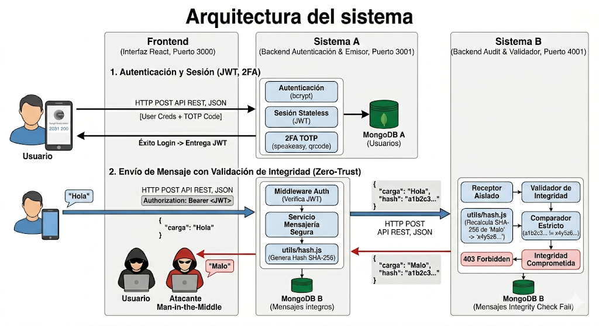
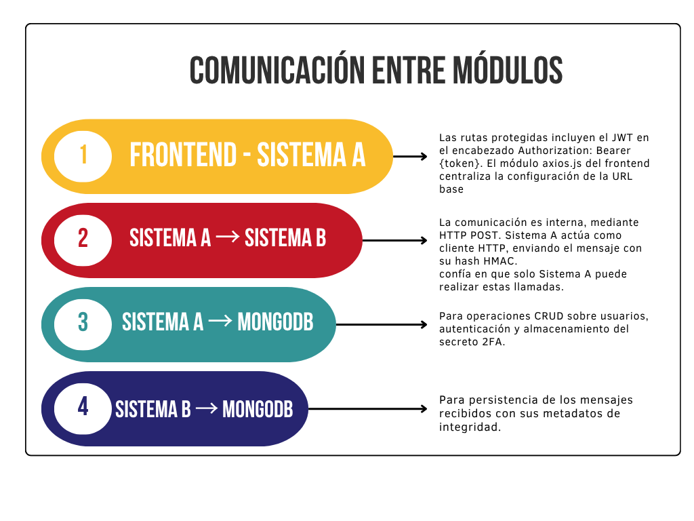

# Proyecto de Arquitectura Segura — Autenticación 2FA e Integridad Zero-Trust

Este repositorio contiene la implementación completa de una arquitectura distribuida orientada a la seguridad. El sistema aborda las problemáticas de acceso indebido y alteración de datos en tránsito mediante la separación estricta de responsabilidades en tres módulos principales.

El proyecto cumple con los estándares de autenticación robusta (Stateless) y el principio de **"Cero Confianza"** en la comunicación entre servidores.

---

## Descripción Arquitectura Sistema Completo

La solución está dividida en tres componentes independientes que se comunican a través de peticiones HTTP RESTful:

1. **Frontend (Capa de Presentación):** Interfaz de usuario construida con React que gestiona los formularios de registro, validación de códigos QR (2FA) y el panel de envío de mensajes.
2. **Sistema A (Proveedor de Identidad y Emisor):** Backend central encargado de la autenticación de usuarios, gestión de sesiones con JWT, validación del segundo factor (TOTP) y generación de firmas criptográficas (SHA-256).
3. **Sistema B (Bóveda y Validador de Integridad):** Microservicio aislado cuya única misión es recibir mensajes, auditar que las firmas criptográficas coincidan y almacenar la información de forma segura.

---

## Requisitos de Seguridad Implementados

El sistema fue diseñado para cumplir con los siguientes pilares:

- **Lógica de Autenticación:** Verificación de credenciales protegidas con `bcrypt` y emisión de tokens JWT.
- **Segundo Factor (2FA):** Solicitud obligatoria de un código temporal (basado en el tiempo) usando Google Authenticator antes de conceder acceso al sistema.
- **Separación de Responsabilidades:** Desacoplamiento total entre la lógica de negocio, la autenticación y la validación de integridad.
- **Integridad de Mensajes:** Uso de funciones Hash en ambos extremos para garantizar que cualquier mensaje alterado en la red sea detectado y rechazado automáticamente.

---

## Diagrama de Arquitectura Sistema Completo



> La comunicación entre el Frontend y el Sistema A está protegida por JWT en las cabeceras de autorización, mientras que la comunicación entre el Sistema A y el Sistema B viaja firmada criptográficamente.

## Diagrama de Comunicación entre Modulos

La siguiente representación gráfica muestra de manera más simple  la comunicación entre los tres modulos planteados para el desarrollo de este proyecto.



---

## Estructura del Repositorio

```
Proyecto_Seguridad/
├── assets/         # Archivos de documentación y diagramas
├── Frontend/       # Interfaz de usuario (React)
├── SistemaA/       # Backend principal (Autenticación y Emisión) — Puerto 3000
├── SistemaB/       # Backend secundario (Validación y Almacenamiento) — Puerto 4000
└── README.md       # Documentación general
```

---

## Instrucciones de Ejecución

Para levantar la arquitectura completa en un entorno local, es necesario iniciar cada sistema por separado.

**1. Base de Datos**

Asegúrese de tener el servicio de MongoDB en ejecución:

```
mongodb://localhost:27017
```

**2. Sistema A**

```bash
cd SistemaA
npm install
npm run dev
```

**3. Sistema B**

```bash
cd SistemaB
npm install
npm run dev
```

**4. Frontend**

```bash
cd Frontend
npm install
npm run dev
```

> Para detalles específicos sobre las variables de entorno y endpoints, consulte el archivo `README.md` dentro de la carpeta de cada sistema.

---

## Escenarios de Prueba Cubiertos

El proyecto ha superado con éxito los siguientes escenarios de seguridad:

- [x] Credenciales y 2FA correctos → Acceso permitido.
- [x] Credenciales incorrectas → Acceso denegado.
- [x] 2FA incorrecto o expirado → Acceso denegado.
- [x] Transmisión de mensaje íntegro → Aceptado y almacenado por el Sistema B.
- [x] Transmisión de mensaje alterado → Rechazo inmediato (`Error 403`) por el Sistema B.

---

## Documentación Técnica

El detalle exhaustivo de los flujos de comunicación, decisiones arquitectónicas y análisis de *Trade-offs* se encuentra en:

```
Taller3_Seguridad_AlixonLopez_RobinsonMolina.pdf
```

Adicionalmente, puede encontrar las pautas y especificaciones del taller-proyceto en: 

```
Proyecto_Seguridad_Software_II.pfd
```
---

## Autores

- **Alixon Lopez** — [@Alix0n](https://github.com/Alix0n)
- **Robinson Molina** — [@RobinsonMolina](https://github.com/RobinsonMolina)