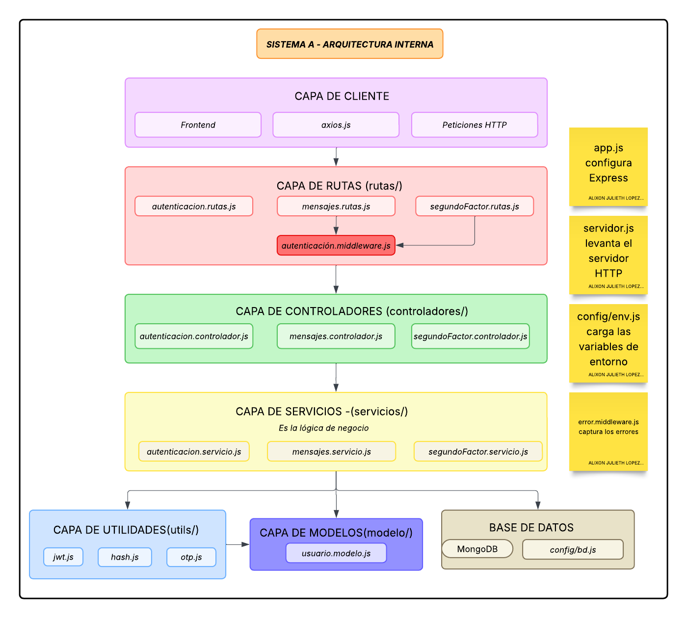

# Sistema A — Backend de autenticación e integridad

Este proyecto corresponde al sistema principal de una arquitectura  orientada a la seguridad. Actúa como el punto de entrada para los usuarios, gestionando autenticación, autorización y protección de la información antes de su envío a otros sistemas (sistema B).

El sistema implementa mecanismos  de seguridad como JWT, 2FA y firma de mensajes, asegurando confidencialidad, integridad y control de acceso.

---

## Descripción General

El Sistema A tiene como objetivo:

- Gestionar el ciclo de vida de los usuarios (registro e inicio de sesión).
- Implementar autenticación robusta con doble factor (2FA).
- Garantizar la integridad de los mensajes mediante funciones hash.
- Servir como intermediario seguro entre el cliente y otros sistemas de la arquitectura.

---

## Características Principales

- **Registro y Autenticación:**
  - Cifrado de contraseñas usando `bcrypt`.
  - Generación y validación de tokens con JSON Web Tokens (JWT).

- **Autenticación de Dos Factores (2FA):**
  - Generación de secretos TOTP con `speakeasy`.
  - Creación de códigos QR con `qrcode`.
  - Validación de códigos temporales para acceso seguro.

- **Firma de Mensajes (Integridad):**
  - Uso de la librería nativa `crypto`.
  - Generación de hash SHA-256 antes de enviar información al Sistema B.
  - Detección de alteraciones en tránsito.

- **Comunicación entre Sistemas:**
  - Envío de mensajes firmados hacia un sistema externo (Sistema B).
  - Arquitectura desacoplada mediante consumo de API REST.

---

## Diagrama simple de arquitectura.



##  Arquitectura del Sistema

```
SistemaA/
├── src/
│   ├── config/        
│   ├── controladores/        
│   ├── rutas/                
│   ├── middlewares/          
│   ├── servicios/            
│   ├── modelos/              
│   └── utils/   
│   └── app.js 
│   └── servidor.js             
│
├── .env                      
├── package.json
├── package-lock.json
├── node_modules
└── README.md
```

---

## Comenzando

Estas instrucciones le permiten ejecutar el proyecto en tu entorno local.

### Requisitos Previos

- Node.js (v18 o superior)
- MongoDB (local o Atlas)
- npm o yarn

Verifica Node.js con:

```bash
node -v
```

---

## Instalación

**1. Clonar el repositorio:**

```bash
git clone https://github.com/tu-usuario/sistemaA.git
```

**2. Acceder al proyecto:**

```bash
cd sistemaA
```

**3. Instalar dependencias:**

```bash
npm install
```

---

## Configuración

Crea un archivo `.env` en la raíz del proyecto:

```env
PORT=3000
MONGO_URI=mongodb://localhost:27017/tu_base_de_datos_A
JWT_SECRET=tu_clave_super_secreta_jwt
JWT_EXPIRES_IN=1h
SYSTEM_B_URL=http://127.0.0.1:4000/api/messages/receive
```

---

## Ejecución

Para ejeuctar escriba el siguiente comando en la terminal.

```bash
npm run dev
```

El servidor estará disponible en:

```
http://localhost:3000
```

---

## Endpoints Principales

### Autenticación

- `POST /api/autenticacion/registrar`  
  Registra un nuevo usuario.

- `POST /api/autenticacion/iniciar-sesion`  
  Valida credenciales y determina si el usuario tiene 2FA activo.

---

### Segundo Factor (2FA)

- `POST /api/segundo-factor/generar`  
  Genera el código QR para configurar 2FA.

- `POST /api/segundo-factor/verificar`  
  Activa el 2FA en la cuenta del usuario.

- `POST /api/segundo-factor/validar-login`  
  Valida el código TOTP y entrega el JWT final.

---

### Mensajería Segura

- `POST /api/mensajes/enviar` *(Requiere JWT)*  
  - Recibe un mensaje  
  - Genera su hash SHA-256  
  - Lo envía al Sistema B junto con su firma  

---

## Flujo de Autenticación

1. Usuario se registra  
2. Inicia sesión con usuario y contraseña  
3. Si tiene 2FA:  
   - Debe validar código TOTP  
4. Se genera un JWT  
5. El usuario puede acceder a endpoints protegidos  

---

## Flujo de Envío de Mensajes

1. Usuario autenticado envía mensaje  
2. El sistema:  
   - Genera hash SHA-256  
   - Adjunta firma al mensaje  
3. Se envía al Sistema B  
4. El Sistema B verifica integridad  

---

## Tecnologías Utilizadas

- Node.js — Entorno de ejecución  
- Express — Framework backend  
- MongoDB — Base de datos  
- Mongoose — ODM  
- bcrypt — Hash de contraseñas  
- jsonwebtoken — Autenticación JWT  
- speakeasy — Generación TOTP  
- qrcode — Generación QR  
- crypto — Hash SHA-256  

---

## Articulo 

Puede encontrar la documentación completa del taller en el documento pdf denominado Taller3_Seguridad_AlixonLopez_RobinsonMolina.pdf

## Autores

* **Alixon Lopez** - *Desarrollo completo* - [Alix0n]((https://github.com/Alix0n)
* **Robinson Molina** - *Desarrollo completo* - [RobinsonMolina]((https://github.com/RobinsonMolina)

---

