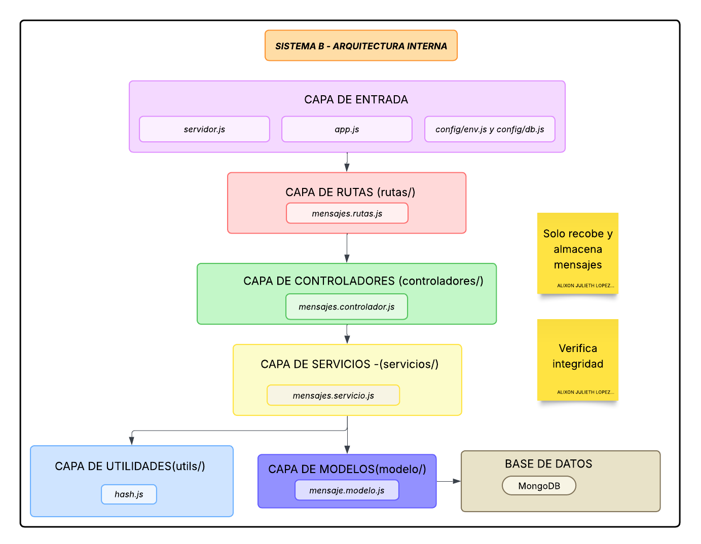

# Sistema B — Backend Verificador de Integridad

Este proyecto corresponde al microservicio secundario de la arquitectura, actuando como un receptor aislado bajo el principio de **"Cero Confianza" (Zero-Trust)**. Su responsabilidad principal es recibir mensajes desde el Sistema A, auditar su integridad matemática y almacenarlos de forma segura en la base de datos.

A diferencia del Sistema A, este módulo no gestiona usuarios ni sesiones, enfocándose estrictamente en la validación de firmas criptográficas para prevenir ataques de alteración de datos en tránsito (Man-in-the-Middle).

---

## Descripción General

El Sistema B tiene como objetivo:

- Actuar como un microservicio independiente especializado en la recepción de datos.
- Verificar la integridad de la información recalculando funciones hash SHA-256.
- Rechazar automáticamente cualquier petición que presente alteraciones en su carga útil.
- Persistir los mensajes catalogados como "Íntegros" en la base de datos.

---

## Características Principales

- **Recepción Aislada:**
  - Exposición de un endpoint dedicado exclusivamente a la escucha de peticiones del Sistema A.
  - Desacoplamiento total de la lógica de autenticación.

- **Verificación Zero-Trust (Integridad):**
  - Recálculo independiente del hash utilizando la librería `crypto` (SHA-256).
  - Comparación estricta entre el hash local y el hash recibido por la red.

- **Almacenamiento Condicionado:**
  - Uso de MongoDB y Mongoose para guardar el historial de mensajes.
  - Registro de metadatos de seguridad (estado de integridad, remitente, timestamp original).

---

## Diagrama de Arquitectura



---

## Estructura del Proyecto

```
SistemaB/
├── assets/
├── src/
│   ├── config/
│   ├── controladores/
│   ├── rutas/
│   ├── servicios/
│   ├── modelos/
│   ├── utils/
│   │   └── hash.js
│   ├── app.js
│   └── servidor.js
├── .env
├── package.json
├── package-lock.json
├── node_modules/
└── README.md
```

---

## Comenzando

Estas instrucciones le permiten ejecutar el microservicio en su entorno local.

### Requisitos Previos

- Node.js (v18 o superior)
- MongoDB (local o Atlas)
- npm o yarn

Verifica tu versión de Node.js con:

```bash
node -v
```

---

## Instalación

**1. Clonar el repositorio:**

```bash
git clone https://github.com/Alix0n/Seguridad-2fa.git
```

**2. Acceder al proyecto:**

```bash
cd sistemaB
```

**3. Instalar dependencias:**

```bash
npm install
```

---

## Configuración

Crea un archivo `.env` en la raíz del proyecto con el siguiente contenido:

```env
PORT=4000
MONGO_URI=mongodb://localhost:27017/tu_base_de_datos_B
```

> **Nota:** Este sistema no requiere `JWT_SECRET` ya que su validación es estrictamente matemática sobre el payload.

---

## Ejecución

Para ejecutar el servidor en modo desarrollo:

```bash
npm run dev
```

El servidor estará disponible en:

```
http://localhost:4000
```

---

## Endpoints Principales

### Recepción de Mensajes

**`POST /api/mensajes/recibir`**

- Recibe la carga útil y el hash desde el Sistema A.
- Recalcula el hash para verificar la integridad.
- Retorna `200 OK` si el mensaje es íntegro.
- Retorna `403 Forbidden` si el mensaje fue alterado.

---

## Tecnologías Utilizadas

| Tecnología | Descripción |
|------------|-------------|
| Node.js | Entorno de ejecución |
| Express | Framework backend |
| MongoDB | Base de datos |
| Mongoose | ODM para MongoDB |
| crypto | Hash SHA-256 para validación de integridad |

---

## Documentación

Puedes encontrar la documentación completa de la arquitectura y decisiones de diseño en el archivo:

```
Taller3_Seguridad_AlixonLopez_RobinsonMolina.pdf
```

---

## Autores

- **Alixon Lopez** — Desarrollo completo — [@Alix0n](https://github.com/Alix0n)
- **Robinson Molina** — Desarrollo completo — [@RobinsonMolina](https://github.com/RobinsonMolina)